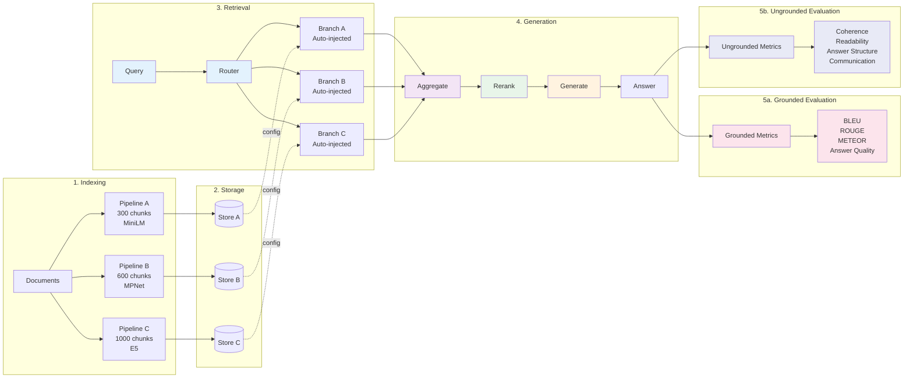

<div align="center">
  
  <h1>Agentic RAG</h1>
  <p><strong>Multi-pipeline RAG with automatic component orchestration</strong></p>

  [](https://www.python.org/downloads/)
  [](https://opensource.org/licenses/MIT)
</div>

---

## What is Agentic RAG?

A component-based RAG system that lets you query **multiple vector stores with different embeddings and chunking strategies** simultaneously. Built on Haystack 2.0 with Neo4j for pipeline orchestration.

**Key Idea**: Create multiple indexing pipelines with different configurations (chunk sizes, embedding models), then automatically inject and orchestrate them at retrieval time.

## Architecture



## How It Works

**1. Create diverse indexing pipelines** with different strategies:
```python
Pipeline A: Small chunks (300) + MiniLM embeddings → Store A
Pipeline B: Medium chunks (600) + MPNet embeddings → Store B
Pipeline C: Large chunks (1000) + E5 embeddings → Store C
```

**2. System stores configuration in Neo4j**:
- Component types, parameters, connections
- Embedding models, storage paths, chunk sizes

**3. At retrieval, specify which pipelines to query**:
```python
retrieval_pipeline = {
    "_indexing_pipelines": ["Pipeline A", "Pipeline B"]  # Query 2 of 3
}
```

**4. System automatically creates parallel branches**:
```python
Branch A: Query Embedder (MiniLM) → Retriever (Store A) → Docs
Branch B: Query Embedder (MPNet) → Retriever (Store B) → Docs
↓
Aggregated → Reranked → Generated Answer
```

Each branch gets the **exact same embedding model and storage path** used during indexing - automatically injected from Neo4j metadata.

## Multi-Project Organization

Organize pipelines into projects for better multi-tenancy:
- **Hierarchy**: `User → Project → Pipelines` (e.g., `alice/rag_app/indexing_pipeline`)
- **Storage**: Automatic path isolation at `data/{username}/{project}/{pipeline}/`
- **Graph**: Components store project field for complete isolation
- **Usage**: Simply add `project="my_app"` to factory and runner methods

Example: `factory.build_pipeline_graphs_from_specs(username="alice", project="rag_app", ...)`

## Testing & Comparing Strategies

This architecture enables systematic **comparison of different RAG strategies** using evaluation metrics:

**1. Create multiple pipelines with different configurations:**
```python
# Test different chunk sizes
Pipeline A: 300-token chunks + MiniLM
Pipeline B: 600-token chunks + MPNet
Pipeline C: 1000-token chunks + E5

# Or test different embedding models
Pipeline X: Semantic chunking + all-MiniLM-L6-v2
Pipeline Y: Semantic chunking + all-mpnet-base-v2
Pipeline Z: Semantic chunking + text-embedding-3-small
```

**2. Query all pipelines simultaneously:**
```python
retrieval_pipeline = {
    "_indexing_pipelines": ["Pipeline A", "Pipeline B", "Pipeline C"]
}
```

**3. Add evaluators to measure answer quality:**
```python
from agentic_rag import Config

# Configure with API key for LLM-based evaluators
config = Config(openrouter_api_key="your-key")

retrieval_spec = [
    [
        {"type": "INDEX"},
        {"type": "GENERATOR.OPENROUTER"},
        # Grounded metrics (require gold standard)
        {"type": "EVALUATOR.BLEU"},           # Lexical overlap
        {"type": "EVALUATOR.ANSWER_QUALITY"}, # LLM-as-judge (needs API key)
        # Ungrounded metrics (no gold standard)
        {"type": "EVALUATOR.COHERENCE"},      # Semantic consistency
        {"type": "EVALUATOR.READABILITY"},    # Reading complexity
    ]
]

# Pass config to components that need it
retrieval_config = {
    "answer_quality_evaluator": {"config": config},
    "openrouter_generator": {"config": config}
}
```

**4. Compare results across configurations:**
```python
# Run queries with different pipeline combinations
result_small = runner.run(pipeline="retrieval", query="...",
                         indexing_pipelines=["Pipeline A"])
result_all = runner.run(pipeline="retrieval", query="...",
                       indexing_pipelines=["Pipeline A", "Pipeline B", "Pipeline C"])

# Compare metrics
print(f"Small chunks only: BLEU={result_small['eval_data']['eval_metrics']['bleu_4']['score']}")
print(f"All strategies:    BLEU={result_all['eval_data']['eval_metrics']['bleu_4']['score']}")
```

**Why This Matters:**
- **No commitment**: Test strategies without rebuilding your entire system
- **Rapid iteration**: Add/remove indexing pipelines independently
- **Data-driven decisions**: Use metrics to choose optimal configurations
- **Strategy mixing**: Let reranking select best chunks across all strategies

## Installation

```bash
git clone https://github.com/arkhai/agentic-rag.git
cd agentic-rag
poetry install
```

**Requirements**: Python 3.10+, Neo4j

### Configuration

Agentic RAG supports two ways to provide configuration:

**1. Using Config object (Recommended for SDK usage):**
```python
from agentic_rag import Config

config = Config(
    neo4j_uri="bolt://localhost:7687",
    neo4j_username="neo4j",
    neo4j_password="password",
    openrouter_api_key="your-key"  # For LLM-based evaluators and generators
)
```

**2. Environment variables (Fallback):**
```bash
export NEO4J_URI="bolt://localhost:7687"
export NEO4J_USERNAME="neo4j"
export NEO4J_PASSWORD="password"
export OPENROUTER_API_KEY="your-key"
```

The Config object takes priority, with environment variables used as fallback if not provided.

## Quick Start

### 1. Index documents with multiple strategies

```python
from agentic_rag import Config
from agentic_rag.pipeline import PipelineFactory, PipelineRunner
from agentic_rag.components import GraphStore

# Initialize configuration
config = Config(
    neo4j_uri="bolt://localhost:7687",
    neo4j_username="neo4j",
    neo4j_password="password"
)

factory = PipelineFactory(config=config, username="myuser")

# Create 2 indexing pipelines with different chunk sizes
indexing_specs = [
    [
        {"type": "CONVERTER.MARKITDOWN_PDF"},
        {"type": "CHUNKER.MARKDOWN_AWARE"},
        {"type": "EMBEDDER.SENTENCE_TRANSFORMERS_DOC"},
        {"type": "WRITER.CHROMA_DOCUMENT_WRITER"}
    ]
]

configs = [
    {
        "_pipeline_name": "small_chunks",
        "markdown_aware_chunker": {"chunk_size": 300},
        "document_embedder": {"model": "all-MiniLM-L6-v2"},
        "chroma_document_writer": {"root_dir": "./data/small"}
    },
    {
        "_pipeline_name": "large_chunks",
        "markdown_aware_chunker": {"chunk_size": 1000},
        "document_embedder": {"model": "all-mpnet-base-v2"},
        "chroma_document_writer": {"root_dir": "./data/large"}
    }
]

# Build and store in Neo4j
factory.build_pipeline_graphs_from_specs(
    pipeline_specs=indexing_specs * 2,
    configs=configs,
    pipeline_types=["indexing", "indexing"]
)

# Index documents
runner = PipelineRunner(
    username="myuser",
    pipeline_names=["small_chunks", "large_chunks"],
    config=config
)
runner.run(pipeline_name="small_chunks", type="indexing", data_path="./docs/paper.pdf")
runner.run(pipeline_name="large_chunks", type="indexing", data_path="./docs/paper.pdf")
```

### 2. Query multiple pipelines simultaneously

```python
# Create retrieval pipeline that queries both stores
retrieval_spec = [
    [
        {"type": "INDEX"},  # Auto-injects embedders/retrievers from indexing pipelines
        {"type": "RANKER.SENTENCE_TRANSFORMERS_SIMILARITY"},
        {"type": "GENERATOR.PROMPT_BUILDER"},
        {"type": "GENERATOR.OPENROUTER"}
    ]
]

retrieval_config = [
    {
        "_pipeline_name": "multi_retrieval",
        "_indexing_pipelines": ["small_chunks", "large_chunks"],  # Query both!
        "chroma_embedding_retriever": {"top_k": 5},
        "sentence_transformers_similarity_ranker": {"top_k": 3},
        "openrouter_generator": {"model": "anthropic/claude-3.5-sonnet"}
    }
]

factory.build_pipeline_graphs_from_specs(
    pipeline_specs=retrieval_spec,
    configs=retrieval_config,
    pipeline_types=["retrieval"]
)

# Query retrieves from both stores, reranks, generates answer
runner = PipelineRunner(
    username="myuser",
    pipeline_names=["multi_retrieval"],
    config=config
)
result = runner.run(
    pipeline_name="multi_retrieval",
    type="retrieval",
    query="What are the main findings?"
)

print(f"Retrieved {result['total_documents']} documents from {result['branches_count']} branches")
print(f"Answer: {result['replies'][0]}")
```

## Why This Matters

**Problem**: Different chunking strategies and embedding models excel at different tasks:
- Small chunks + lightweight embeddings: Fast, good for facts
- Large chunks + powerful embeddings: Better for context, reasoning

**Traditional approach**: Pick one strategy, hope it works

**Agentic RAG**:
- Use them all simultaneously, let reranking select the best results
- Test and compare strategies with built-in evaluation metrics
- Make data-driven decisions about which configurations work best

## Evaluation

Built-in evaluation metrics for answer quality:

```python
from agentic_rag import Config

# Configure with OpenRouter API key for LLM-based evaluators
config = Config(
    neo4j_uri="bolt://localhost:7687",
    neo4j_username="neo4j",
    neo4j_password="password",
    openrouter_api_key="your-key"  # Required for LLM-based evaluators
)

# Add evaluators to your retrieval pipeline
retrieval_spec = [
    [
        {"type": "INDEX"},
        {"type": "GENERATOR.OPENROUTER"},
        {"type": "EVALUATOR.BLEU"},           # Lexical overlap
        {"type": "EVALUATOR.ANSWER_QUALITY"}, # LLM-as-judge (requires API key)
        {"type": "EVALUATOR.COHERENCE"},      # Semantic consistency
    ]
]

# Pass config to components that need it
retrieval_config = [
    {
        "_pipeline_name": "multi_retrieval",
        "_indexing_pipelines": ["small_chunks", "large_chunks"],
        "answer_quality_evaluator": {"config": config},  # Pass config to evaluator
        "openrouter_generator": {"config": config}       # Pass config to generator
    }
]

result = runner.run(
    pipeline_name="multi_retrieval",
    type="retrieval",
    query="What is machine learning?",
    ground_truth_answer="ML is a subset of AI..."  # Optional for grounded metrics
)

print(result['eval_data']['eval_metrics'])
# {
#   "bleu_4": {"score": 0.65},
#   "answer_quality_overall": {"score": 0.85},
#   "coherence": {"score": 0.78}
# }
```

**Grounded metrics** (require gold standard):
- BLEU, ROUGE, METEOR - Lexical overlap
- Answer Quality, Fact Matching - LLM-based evaluation (require OpenRouter API key)

**Ungrounded metrics** (no gold standard):
- Coherence - Semantic consistency (local embeddings)
- Readability - Reading level, complexity (algorithmic)
- Answer Structure - Organization, formatting (requires OpenRouter API key)
- Communication Quality - Tone, professionalism (requires OpenRouter API key)

**Note**: LLM-based evaluators (Answer Quality, Fact Matching, Answer Structure, Communication Quality, LongQA, MoRQA) require an OpenRouter API key provided via `Config`.

## Development

```bash
# Install dev dependencies
poetry install

# Run tests
make test

# Run specific test
poetry run pytest tests/test_multi_pipeline.py -v

# Type checking
make type-check

# Format code
make format
```

## Components

**Converters**: PDF → Markdown (MarkItDown, Marker)
**Chunkers**: Markdown-aware, Semantic boundary detection
**Embedders**: Sentence Transformers (document/query modes)
**Writers/Retrievers**: ChromaDB
**Generators**: OpenAI, OpenRouter (Claude, etc.)
**Rankers**: Cross-encoder reranking
**Evaluators**: BLEU, ROUGE, METEOR, Answer Quality, Coherence, Readability

See [`agentic_rag/types/component_enums.py`](agentic_rag/types/component_enums.py) for full component list.

## License

MIT License

## Built With

[Haystack 2.0](https://haystack.deepset.ai/) · [ChromaDB](https://www.trychroma.com/) · [Neo4j](https://neo4j.com/)
