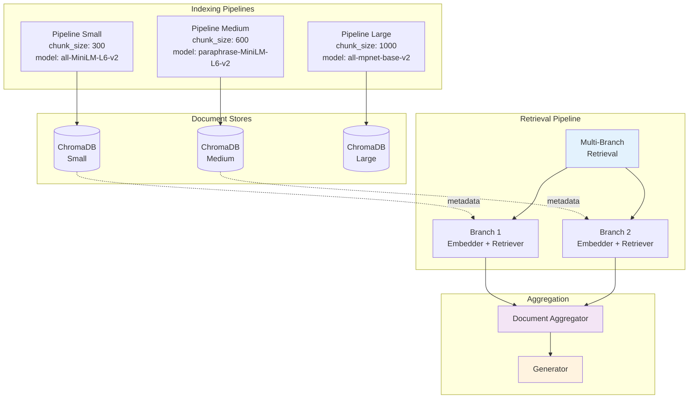
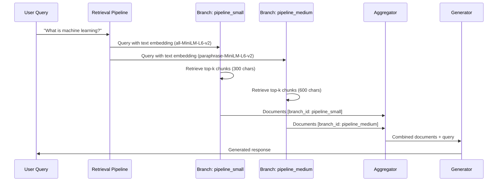

<div align="center">
  
  <h1>Agentic RAG</h1>
  <p>Multi-store retrieval pipeline with automatic component injection</p>

  [](https://www.python.org/downloads/)
  [](https://opensource.org/licenses/MIT)
</div>

---

## Overview

Agentic RAG is a component-based RAG system enabling **multi-store retrieval** across heterogeneous vector databases with different embedding models and chunking strategies. Built on Haystack 2.0, it automatically injects and orchestrates components from indexed pipelines into retrieval workflows.

### Key Features

- **Multi-Store Retrieval**: Query multiple vector stores with different embeddings simultaneously
- **Auto-Injection**: Automatically derive embedders and retrievers from indexing pipeline metadata
- **Branch Pipelines**: Independent execution paths per document store with result aggregation
- **Config Inheritance**: Embedding models and storage paths inherited from indexing pipelines
- **Graph-Based Storage**: Pipeline definitions and component relationships stored in Neo4j
- **Type-Safe Components**: Strongly typed specifications with validation

## Architecture



### Retrieval Flow



## Installation

```bash
# Clone repository
git clone https://github.com/arkhai/agentic-rag.git
cd agentic-rag

# Install with Poetry
poetry install

# Or with pip
pip install -e .
```

## Quick Start

### 1. Create Indexing Pipelines

```python
from agentic_rag.pipeline.factory import PipelineFactory
from agentic_rag.components.neo4j_manager import GraphStore

# Initialize
factory = PipelineFactory(graph_store=GraphStore())

# Define indexing pipelines with different chunking strategies
indexing_specs = [
    [
        {"type": "CONVERTER.MARKITDOWN_PDF"},
        {"type": "CHUNKER.MARKDOWN_AWARE"},
        {"type": "EMBEDDER.SENTENCE_TRANSFORMERS_DOC"},
        {"type": "WRITER.CHROMA_DOCUMENT_WRITER"}
    ]
]

indexing_configs = [
    {
        "_pipeline_name": "pipeline_small",
        "markdown_aware_chunker": {"chunk_size": 300, "chunk_overlap": 30},
        "document_embedder": {"model": "sentence-transformers/all-MiniLM-L6-v2"},
        "chroma_document_writer": {"root_dir": "./data/user/pipeline_small"}
    },
    {
        "_pipeline_name": "pipeline_medium",
        "markdown_aware_chunker": {"chunk_size": 600, "chunk_overlap": 60},
        "document_embedder": {"model": "sentence-transformers/paraphrase-MiniLM-L6-v2"},
        "chroma_document_writer": {"root_dir": "./data/user/pipeline_medium"}
    }
]

# Create pipelines
pipelines = factory.build_pipeline_graphs_from_specs(
    pipeline_specs=indexing_specs * 2,
    configs=indexing_configs,
    pipeline_types=["indexing", "indexing"],
    username="user"
)
```

### 2. Index Documents

```python
from agentic_rag.pipeline.runner import PipelineRunner

# Initialize runner
runner = PipelineRunner(
    graph_store=graph_store,
    username="user",
    pipeline_names=["pipeline_small", "pipeline_medium"]
)

# Index documents
for pipeline_name in ["pipeline_small", "pipeline_medium"]:
    runner.run(
        pipeline_name=pipeline_name,
        type="indexing",
        data_path="./documents/sample.pdf"
    )
```

### 3. Create Multi-Store Retrieval Pipeline

```python
# Define retrieval pipeline connecting to multiple indexing pipelines
retrieval_spec = [
    [
        {"type": "INDEX"},  # Auto-injects embedders and retrievers
        {"type": "GENERATOR.PROMPT_BUILDER"},
        {"type": "GENERATOR.OPENAI"}
    ]
]

retrieval_config = [
    {
        "_pipeline_name": "retrieval_pipeline",
        "_indexing_pipelines": ["pipeline_small", "pipeline_medium"],
        "chroma_embedding_retriever": {"top_k": 3},
        "prompt_builder": {"template": "Answer based on: {{documents}}"},
        "generator": {"model": "gpt-4"}
    }
]

# Create retrieval pipeline
factory.build_pipeline_graphs_from_specs(
    pipeline_specs=retrieval_spec,
    configs=retrieval_config,
    pipeline_types=["retrieval"],
    username="user"
)
```

### 4. Query Across Multiple Stores

```python
# Auto-load retrieval pipeline
retrieval_runner = PipelineRunner(
    graph_store=graph_store,
    username="user",
    pipeline_names=["retrieval_pipeline"]
)

# Execute multi-store retrieval
result = retrieval_runner.run(
    pipeline_name="retrieval_pipeline",
    type="retrieval",
    query="What is machine learning?"
)

# Results include documents from all branches
print(f"Retrieved {result['total_documents']} documents")
print(f"From {result['branches_count']} branches")

for doc in result['documents']:
    print(f"[{doc.meta['branch_id']}] {doc.content[:100]}...")
```

## Component Auto-Injection

The system automatically injects components based on indexing pipeline metadata:

| Indexing Component | Retrieval Equivalent | Inherited Config |
|-------------------|---------------------|------------------|
| `EMBEDDER.SENTENCE_TRANSFORMERS_DOC` | `EMBEDDER.SENTENCE_TRANSFORMERS` | `model` |
| `WRITER.CHROMA_DOCUMENT_WRITER` | `RETRIEVER.CHROMA_EMBEDDING` | `root_dir` |

Users can override inherited configurations:

```python
# Override top_k for retrieval
"chroma_embedding_retriever": {"top_k": 5}  # Default: inherited from indexing
```

## Available Components

### Converters
- `CONVERTER.MARKITDOWN_PDF` - PDF to markdown conversion
- `CONVERTER.MARKER_PDF` - Enhanced PDF extraction (academic papers)

### Chunkers
- `CHUNKER.MARKDOWN_AWARE` - Preserves markdown structure
- `CHUNKER.SEMANTIC` - Semantic boundary detection

### Embedders
- `EMBEDDER.SENTENCE_TRANSFORMERS` - Text embedding (retrieval)
- `EMBEDDER.SENTENCE_TRANSFORMERS_DOC` - Document embedding (indexing)

### Retrievers
- `RETRIEVER.CHROMA_EMBEDDING` - Vector similarity search

### Generators
- `GENERATOR.PROMPT_BUILDER` - Jinja2 template-based prompts
- `GENERATOR.OPENAI` - OpenAI GPT models

### Writers
- `WRITER.CHROMA_DOCUMENT_WRITER` - ChromaDB persistence

## Configuration

### Pipeline-Level Config
```python
{
    "_pipeline_name": "my_pipeline",
    "_indexing_pipelines": ["pipeline_1", "pipeline_2"],  # For retrieval only
}
```

### Component-Level Config
```python
{
    "component_name": {
        "param1": "value1",
        "param2": "value2"
    }
}
```

## Development

```bash
# Install dependencies
poetry install

# Run tests
make test

# Run specific test
poetry run pytest tests/test_multi_pipeline.py -v

# Type checking
make type-check

# Format code
make format
```

## Project Structure

```
agentic_rag/
├── components/
│   ├── chunkers/          # Custom chunking implementations
│   ├── converters/        # Document converters
│   ├── gates/             # Component caching layer
│   ├── neo4j_manager.py   # Graph database operations
│   └── registry.py        # Component registry
├── pipeline/
│   ├── factory.py         # Pipeline creation and auto-injection
│   ├── runner.py          # Pipeline execution and branching
│   └── storage.py         # Neo4j pipeline storage
└── types/
    ├── component_enums.py # Component type definitions
    ├── pipeline_spec.py   # Pipeline specifications
    └── data_types.py      # Data type definitions
```

## License

MIT License - see [LICENSE](LICENSE) file for details.

## Acknowledgments

Built on [Haystack 2.0](https://haystack.deepset.ai/) by deepset, [ChromaDB](https://www.trychroma.com/), and [Neo4j](https://neo4j.com/).
