# Agentic RAG

A flexible, component-based RAG (Retrieval-Augmented Generation) pipeline system built on Haystack 2.0. Create powerful document processing and retrieval pipelines with minimal configuration.

## 🏗️ Architecture Overview

```mermaid
graph TB
    subgraph "Pipeline Runner"
        PR[PipelineRunner]
        PR --> IPL[Indexing Pipeline]
        PR --> RPL[Retrieval Pipeline]
    end

    subgraph "Pipeline Factory"
        PF[PipelineFactory]
        PF --> PB[PipelineBuilder]
        PF --> CR[ComponentRegistry]
    end

    subgraph "Components"
        CONV[Converters]
        CHUNK[Chunkers]
        EMBED[Embedders]
        RETR[Retrievers]
        GEN[Generators]
        WRITE[Writers]
    end

    subgraph "Data Stores"
        CHROMA[(ChromaDB)]
        FILES[📄 Documents]
    end

    PR --> PF
    PB --> CR
    CR --> CONV
    CR --> CHUNK
    CR --> EMBED
    CR --> RETR
    CR --> GEN
    CR --> WRITE

    WRITE --> CHROMA
    RETR --> CHROMA
    CONV --> FILES
```



## ✨ Features

- **🔧 Component-based Architecture**: Modular pipeline components for converters, chunkers, embedders, retrievers, and generators
- **🎯 Custom Components**: Built-in markdown-aware and semantic chunkers optimized for structured documents
- **🗄️ Automatic Document Store Integration**: ChromaDB integration with local persistence and shared datastores
- **🛡️ Type-safe Configuration**: Strongly typed component specifications and configurations
- **🏭 Factory Pattern**: Dynamic pipeline creation from simple specifications
- **⚡ Runtime Parameter Support**: Override component parameters at execution time
- **🔄 End-to-end Workflows**: Complete indexing → retrieval → generation pipelines

## Quick Start

### Installation

```bash
pip install -e .
```

## 📊 Pipeline Flow

### Indexing Pipeline

```mermaid
flowchart LR
    DOC[📄 Documents] --> CONV[Converter]
    CONV --> CHUNK[Chunker]
    CHUNK --> EMBED[Document Embedder]
    EMBED --> WRITE[Document Writer]
    WRITE --> DB[(ChromaDB)]

    style DOC fill:#e1f5fe
    style DB fill:#f3e5f5
```


### Retrieval Pipeline


### Basic Usage

```python
from agentic_rag import PipelineRunner

# Initialize the runner
runner = PipelineRunner()

# Create an indexing pipeline
indexing_spec = [
    {"type": "CONVERTER.TEXT"},
    {"type": "CHUNKER.MARKDOWN_AWARE"},
    {"type": "EMBEDDER.SENTENCE_TRANSFORMERS_DOC"},
    {"type": "WRITER.DOCUMENT_WRITER"}
]

# Load the pipeline
runner.load_pipeline(indexing_spec, "my_indexing_pipeline")

# Index documents
from haystack import Document
documents = [
    Document(content="# AI Overview\n\nArtificial Intelligence is transforming industries...")
]

results = runner.run("indexing", {"documents": documents})
print(f"Indexed {results['processed_count']} documents")
```

## 🧩 Available Components

### Converters
- **`CONVERTER.PDF`** - Standard PDF text extraction
- **`CONVERTER.MARKER_PDF`** - Enhanced PDF extraction with Marker (better for academic papers)
- **`CONVERTER.DOCX`** - Microsoft Word document processing
- **`CONVERTER.HTML`** - HTML document processing
- **`CONVERTER.TEXT`** - Plain text processing

### Chunkers
- **`CHUNKER.DOCUMENT_SPLITTER`** - Standard recursive text splitting
- **`CHUNKER.MARKDOWN_AWARE`** - Preserves markdown structure and headers
- **`CHUNKER.SEMANTIC`** - Semantic boundary-aware splitting (headers, lists, code blocks)

### Embedders
- **`EMBEDDER.SENTENCE_TRANSFORMERS`** - Text embedding for queries
- **`EMBEDDER.SENTENCE_TRANSFORMERS_DOC`** - Document embedding for indexing

### Retrievers
- **`RETRIEVER.CHROMA_EMBEDDING`** - Vector similarity search with ChromaDB

### Generators
- **`GENERATOR.OPENAI`** - OpenAI GPT-based text generation

### Writers
- **`WRITER.DOCUMENT_WRITER`** - Stores documents in ChromaDB with persistence

## 🔍 Retrieval Example

```python
# Create retrieval pipeline
retrieval_spec = [
    {"type": "EMBEDDER.SENTENCE_TRANSFORMERS"},
    {"type": "RETRIEVER.CHROMA_EMBEDDING"}
]

runner.load_pipeline(retrieval_spec, "my_retrieval_pipeline")

# Search documents with runtime parameters
results = runner.run("retrieval", {
    "query": "What is artificial intelligence?",
    "top_k": 3,  # Return top 3 results
    "filters": {"category": {"$eq": "ai"}}  # Filter by metadata
})

print(f"Found {len(results['results'])} relevant documents")
```

## ⚙️ Configuration

```python
config = {
    "markdown_aware_chunker": {
        "chunk_size": 1000,
        "chunk_overlap": 100
    },
    "document_embedder": {
        "model": "sentence-transformers/all-MiniLM-L6-v2"
    },
    "document_writer": {
        "root_dir": "./my_data"  # Custom ChromaDB location
    }
}

runner.load_pipeline(indexing_spec, "configured_pipeline", config)
```

## 🔄 End-to-End RAG Workflow

```python
from agentic_rag import PipelineRunner
from haystack import Document

# Step 1: Index documents
indexing_runner = PipelineRunner()
indexing_spec = [
    {"type": "CHUNKER.MARKDOWN_AWARE"},
    {"type": "EMBEDDER.SENTENCE_TRANSFORMERS_DOC"},
    {"type": "WRITER.DOCUMENT_WRITER"}
]

config = {
    "document_writer": {"root_dir": "./shared_db"},
    "document_embedder": {"model": "sentence-transformers/all-MiniLM-L6-v2"}
}

indexing_runner.load_pipeline(indexing_spec, "indexing", config)

# Index your documents
documents = [
    Document(content="# Machine Learning\n\nML is a subset of AI...", meta={"topic": "ai"}),
    Document(content="# Python Programming\n\nPython is versatile...", meta={"topic": "programming"})
]

indexing_results = indexing_runner.run("indexing", {"documents": documents})
print(f"✅ Indexed {indexing_results['processed_count']} documents")

# Step 2: Search and retrieve
retrieval_runner = PipelineRunner()
retrieval_spec = [
    {"type": "EMBEDDER.SENTENCE_TRANSFORMERS"},
    {"type": "RETRIEVER.CHROMA_EMBEDDING"}
]

retrieval_config = {
    "chroma_embedding_retriever": {"root_dir": "./shared_db"},  # Same DB
    "embedder": {"model": "sentence-transformers/all-MiniLM-L6-v2"}
}

retrieval_runner.load_pipeline(retrieval_spec, "retrieval", retrieval_config)

# Query the indexed documents
query_results = retrieval_runner.run("retrieval", {
    "query": "machine learning algorithms",
    "top_k": 5
})

print(f"🔍 Found {len(query_results['results'])} relevant documents")
```

## 🗄️ Document Store Integration

ChromaDB is automatically initialized with local persistence:
- **Default path**: `./chroma/` (relative to current directory)
- **Configurable**: Set `root_dir` in component config
- **Shared storage**: Same `root_dir` = shared datastore across pipelines
- **Automatic creation**: Directories created automatically if they don't exist

## 🔧 Component Architecture


## 🧪 Development

```bash
# Install dependencies
poetry install

# Run all tests
make test

# Run specific test categories
poetry run pytest tests/test_pipeline_runner_integration.py -v  # Integration tests
poetry run pytest tests/components/ -v                          # Component tests

# Type checking
make type-check

# Linting and formatting
make lint
make format
```

### Project Structure

```
agentic_rag/
├── components/           # Component implementations
│   ├── chunkers/        # Custom chunking components
│   ├── converters/      # Document conversion components
│   └── registry.py      # Component registry
├── pipeline/            # Pipeline orchestration
│   ├── builder.py       # Pipeline construction
│   ├── factory.py       # Pipeline creation from specs
│   └── runner.py        # Pipeline execution
└── types/               # Type definitions
    ├── component_spec.py
    ├── pipeline_spec.py
    └── data_types.py
```

### Adding Custom Components

1. **Create your component** following Haystack 2.0 patterns:
```python
from haystack import component, Document

@component
class MyCustomChunker:
    def __init__(self, chunk_size: int = 1000):
        self.chunk_size = chunk_size

    @component.output_types(documents=List[Document])
    def run(self, documents: List[Document]) -> Dict[str, List[Document]]:
        # Your chunking logic here
        return {"documents": chunked_docs}
```

2. **Register in ComponentRegistry**:
```python
self.register_component(
    ComponentSpec(
        name="my_custom_chunker",
        component_type=ComponentType.CHUNKER,
        haystack_class="your_module.MyCustomChunker",
        input_types=[DataType.LIST_DOCUMENT],
        output_types=[DataType.LIST_DOCUMENT],
        default_config={"chunk_size": 1000}
    )
)
```

3. **Add to component enums** in `types/component_enums.py`

## 🤝 Contributing

1. Fork the repository
2. Create a feature branch: `git checkout -b feature/amazing-feature`
3. Make your changes and add tests
4. Run the test suite: `make test`
5. Commit your changes: `git commit -m 'Add amazing feature'`
6. Push to the branch: `git push origin feature/amazing-feature`
7. Open a Pull Request

## 📄 License

MIT License - see [LICENSE](LICENSE) file for details

## 🙏 Acknowledgments

- Built on [Haystack 2.0](https://haystack.deepset.ai/) by deepset
- Uses [ChromaDB](https://www.trychroma.com/) for vector storage
- Integrates [SentenceTransformers](https://www.sbert.net/) for embeddings
