# Pipeline Architecture

This module provides a clean separation between pipeline creation (build-time) and pipeline execution (runtime).

## Architecture Overview


## Project Hierarchy

The system supports `User → Project → Pipelines` for multi-tenant organization:
- **Graph**: `(User)-[:OWNS]->(Project)-[:FLOWS_TO]->(Component)-[:FLOWS_TO]->(Component)`
- **Storage**: `data/{username}/{project}/{pipeline_name}/`
- **Isolation**: Component IDs include project name, ensuring complete separation
- **Usage**: Pass `project="my_app"` to factory and runner methods

Example: `factory.build_pipeline_graphs_from_specs(username="alice", project="rag_app", ...)`

## Component Responsibilities

### 🏭 **PipelineFactory** (`factory.py`)
**Purpose**: Creates and validates pipeline specifications
- Parses component specifications from dictionaries
- Validates component types and configurations
- Creates `PipelineSpec` objects
- Delegates to `GraphStorage` for storage

### 💾 **GraphStorage** (`storage.py`)
**Purpose**: Handles all pipeline operations and Neo4j storage
- **Graph Operations**: Stores pipeline components and relationships
- **Component Logic**: Handles substitutions (e.g., writer → retriever)
- **Pipeline Building**: Creates both graph and Haystack representations
- **Connection Logic**: Determines component connections and dependencies
- **Neo4j Management**: Manages DocumentStore nodes and relationships

### 🏃 **PipelineRunner** (`runner.py`)
**Purpose**: Executes pipelines with data
- Load pre-built pipelines from Neo4j
- Execute indexing and retrieval operations
- Handle multi-branch retrieval pipeline orchestration
- Track metrics and performance

## Usage Pattern: Build Once, Run Many

```python
from agentic_rag import Config, PipelineFactory, PipelineRunner

# Configuration
config = Config(
    neo4j_uri="bolt://localhost:7687",
    neo4j_username="neo4j",
    neo4j_password="password"
)

# 1. BUILD TIME - Create pipeline once
factory = PipelineFactory(config=config)
pipelines = factory.build_pipeline_graphs_from_specs(
    pipeline_specs=[[
        {"type": "CONVERTER.TEXT"},
        {"type": "CHUNKER.MARKDOWN_AWARE"},
        {"type": "EMBEDDER.SENTENCE_TRANSFORMERS_DOC"},
        {"type": "WRITER.CHROMA_DOCUMENT_WRITER"}
    ]],
    username="alice",
    project="rag_app",  # Project organization
    configs=[{"_pipeline_name": "my_pipeline"}]
)

# 2. RUNTIME - Load and execute many times
runner = PipelineRunner(config=config)
runner.load_pipelines(
    pipeline_names=["my_pipeline"],
    username="alice",
    project="rag_app"
)

# Execute multiple times
result = runner.run(
    pipeline_name="my_pipeline",
    username="alice",
    project="rag_app",
    type="indexing",
    data_path="./documents"
)
```

## Pipeline Flow

### Creation Flow

```mermaid
sequenceDiagram
    participant U as User
    participant F as PipelineFactory
    participant S as GraphStorage
    participant N as Neo4j

    U->>F: build_pipeline_graphs_from_specs(username, project)
    F->>F: Parse & validate components
    F->>F: Create PipelineSpec objects
    F->>S: create_pipeline_graph(spec, project)
    S->>N: Store User → Project → Components
    S->>N: Create FLOWS_TO relationships
    S-->>F: Graph created
    F-->>U: List[PipelineSpec]
```


### Execution Flow

```mermaid
sequenceDiagram
    participant U as User
    participant R as PipelineRunner
    participant N as Neo4j
    participant H as Haystack Pipeline

    U->>R: load_pipelines(names, username, project)
    R->>N: Query: User → Project → Components
    N-->>R: Component metadata & connections
    R->>R: Build Haystack components from metadata
    R->>H: Create connected pipeline
    H-->>R: Ready

    U->>R: run(pipeline_name, username, project, type)
    R->>H: Execute with input data
    H-->>R: Results
    R-->>U: Execution results
```


## File Structure

```
pipeline/
├── README.md           # This file
├── __init__.py         # Module exports
├── factory.py          # PipelineFactory - creation & validation
├── storage.py          # GraphStorage - all pipeline operations & Neo4j
└── runner.py           # PipelineRunner - execution
```

## Key Benefits

1. **Multi-Tenancy**: User → Project → Pipelines hierarchy for complete isolation
2. **Performance**: Build once, run many times - no graph rebuilding at runtime
3. **Persistence**: Pipelines stored in Neo4j, survive application restarts
4. **Flexibility**: Query multiple indexing pipelines in parallel for retrieval
5. **Auto-Orchestration**: Retrieval pipelines auto-inject embedders/retrievers from indexing metadata
6. **Path Isolation**: Automatic storage at `data/{username}/{project}/{pipeline}/`
