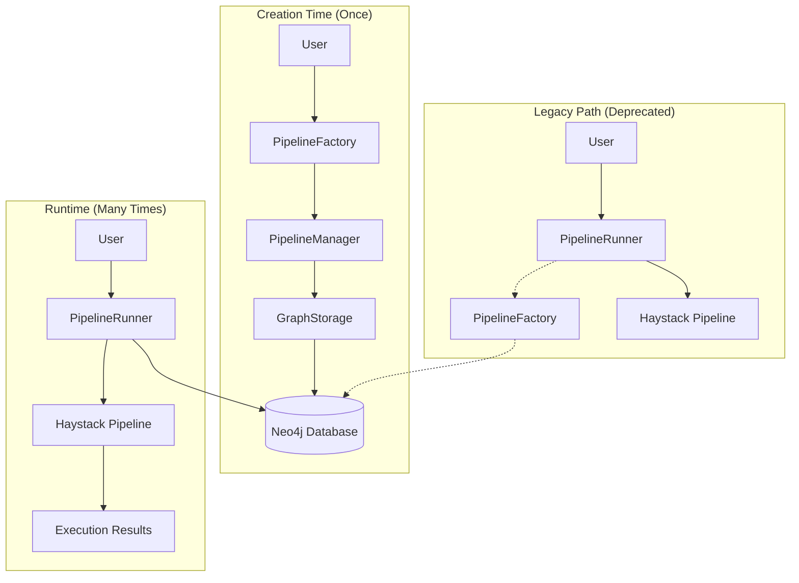
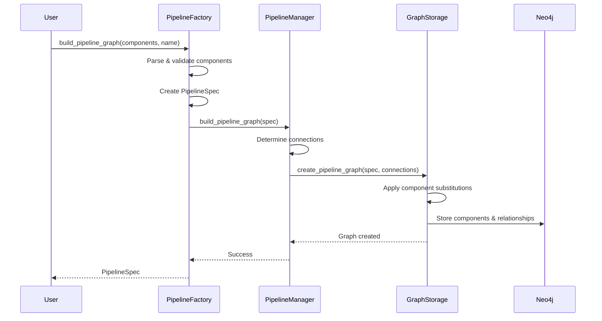
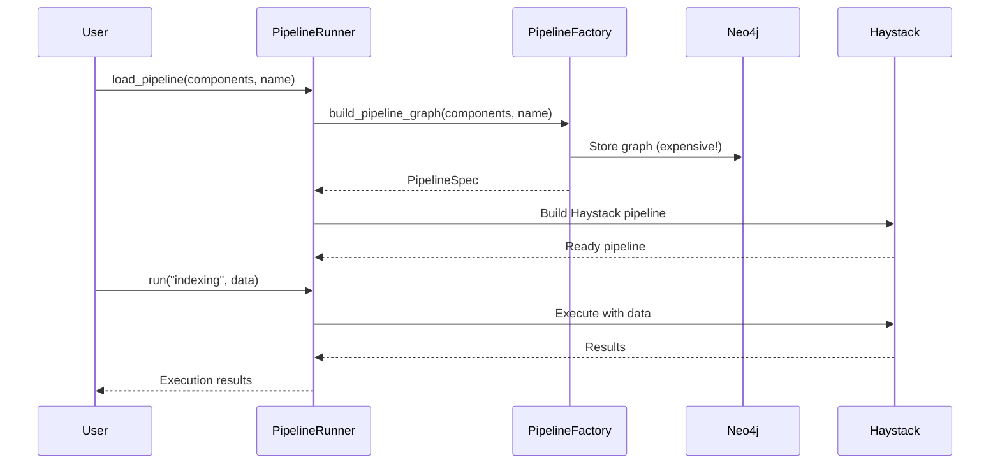

# Pipeline Architecture

This module provides a clean separation between pipeline creation (build-time) and pipeline execution (runtime).

## Architecture Overview



## Component Responsibilities

### 🏭 **PipelineFactory** (`factory.py`)
**Purpose**: Creates and validates pipeline specifications
- Parses component specifications from dictionaries
- Validates component types and configurations
- Creates `PipelineSpec` objects
- Delegates to `PipelineManager` for storage

### 🔧 **PipelineManager** (`manager.py`)
**Purpose**: Manages pipeline lifecycle (creation + runtime)
- **Creation**: Builds graph representations via `GraphStorage`
- **Runtime**: Builds Haystack pipelines from specifications
- Determines component connections and dependencies

### 💾 **GraphStorage** (`storage.py`)
**Purpose**: Handles Neo4j storage and graph operations
- Stores pipeline components and relationships
- Handles component substitutions (e.g., writer → retriever)
- Manages DocumentStore nodes and connections
- Creates centralized graph relationships

### 🏃 **PipelineRunner** (`runner.py`)
**Purpose**: Executes pipelines with data
- **Preferred**: Load pre-built pipelines from Neo4j
- **Legacy**: Create pipelines at runtime (deprecated)
- Execute indexing and retrieval operations
- Handle pipeline input/output mapping

## Usage Patterns

### ✅ **Preferred: Build Once, Run Many**

```python
# 1. BUILD TIME - Create pipeline once
from agentic_rag.pipeline import PipelineFactory
from agentic_rag.components import GraphStore

graph_store = GraphStore()
factory = PipelineFactory(graph_store)

# Build and store in Neo4j
factory.build_pipeline_graph(
    components=[
        {"type": "CONVERTER.PDF"},
        {"type": "CHUNKER.MARKDOWN_AWARE"},
        {"type": "EMBEDDER.SENTENCE_TRANSFORMERS"},
        {"type": "WRITER.CHROMA_DOCUMENT"}
    ],
    pipeline_name="pdf_indexing_pipeline"
)

# 2. RUNTIME - Load and execute many times
from agentic_rag.pipeline import PipelineRunner

runner = PipelineRunner(graph_store=graph_store)
runner.load_from_graph("pdf_indexing_pipeline")  # Fast loading from Neo4j

# Execute multiple times
results1 = runner.run("indexing", {"documents": documents1})
results2 = runner.run("indexing", {"documents": documents2})
```

### ⚠️ **Legacy: Create at Runtime (Deprecated)**

```python
# Creates graph every time - inefficient
runner = PipelineRunner()
runner.load_pipeline(components, "my_pipeline")  # Slow - rebuilds graph
results = runner.run("indexing", data)
```

## Component Interactions

### Creation Flow


### Runtime Flow (Preferred)


### Runtime Flow (Legacy)


## File Structure

```
pipeline/
├── README.md           # This file
├── __init__.py         # Module exports
├── factory.py          # PipelineFactory - creation & validation
├── manager.py          # PipelineManager - lifecycle management
├── storage.py          # GraphStorage - Neo4j operations
└── runner.py           # PipelineRunner - execution
```

## Key Benefits

1. **Performance**: Build once, run many times
2. **Persistence**: Pipelines survive application restarts
3. **Scalability**: No graph rebuilding at runtime
4. **Flexibility**: Load any stored pipeline by name
5. **Clean Separation**: Creation vs execution concerns
6. **Component Substitutions**: Automatic writer→retriever conversion for retrieval pipelines

## Migration Guide

**Old Pattern (Deprecated)**:
```python
runner = PipelineRunner()
runner.load_pipeline(components, "my_pipeline")  # Slow
results = runner.run("indexing", data)
```

**New Pattern (Recommended)**:
```python
# Build once (setup/deployment time)
factory = PipelineFactory(graph_store)
factory.build_pipeline_graph(components, "my_pipeline")

# Run many times (application runtime)
runner = PipelineRunner(graph_store=graph_store)
runner.load_from_graph("my_pipeline")  # Fast
results = runner.run("indexing", data)
```
